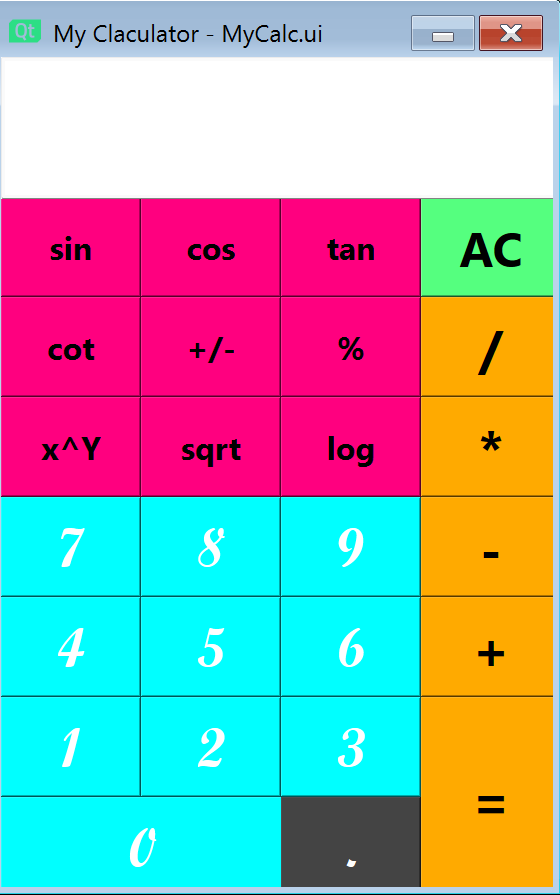

># Assignment_17

# Calculator with Pyside6(Qt)
This is a calculator that writed in python  
And it can calculate the four basic operations as well as operators such as sine and cosine.  
There is also a clear button at the top to clear the text box.

---
>## Files Description

| File name | Description |
|--- | --- |
|main.py | a calculator with 4 main operator, 4 triangle function(sin, cos, tan, cot), SQRT & Log |

>## How to Run
execute this command in terminal:
python main.py

>## Results

The face of calculator is shown below:

output:

